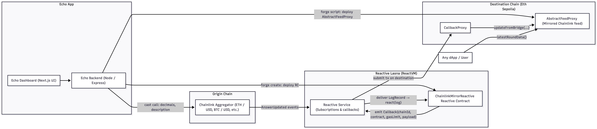
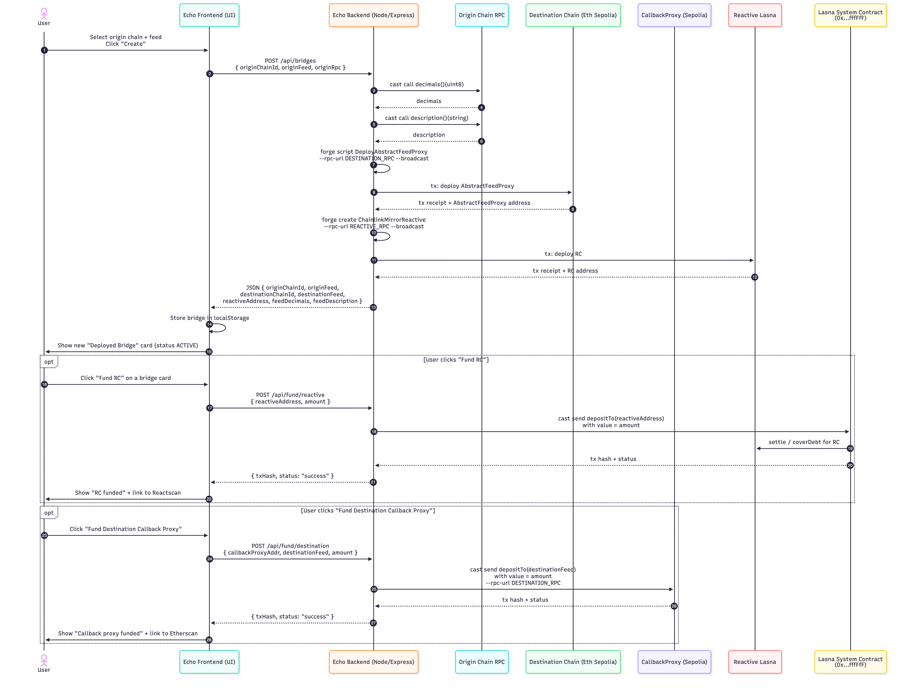

# Cross-Chain Oracle Bridge

## Overview

This project implements a cross-chain oracle system that mirrors Chainlink price feeds from origin chains (such as Base-Sepolia, Binance smart chain, Avalanche Fuji and Polygon Amoy) to a destination chain (Eth-sepolia). The system uses Reactive Network to monitor Chainlink price update events on origin chains and automatically forward them to destination chain contracts that implement the Chainlink AggregatorV3Interface.

You can select multiple price feeds from multiple chains, and deploy from UI. Currently Reactive network supports only limited Source and Destination chains. You can deploy from *ALL* supported origin chains to *ALL* destination chains

The project consists of three main components:

1. **Smart Contracts and Deployment Scripts**: Solidity contracts deployed on Reactive Network and Eth-Sepolia, along with Foundry scripts for deployment and funding operations.

2. **Backend Server**: Node.js Express server that orchestrates contract deployments, handles API requests from the frontend, and manages funding operations for both Reactive contracts and destination callback proxies.

3. **Frontend UI**: React-based web interface for creating new oracle bridges, viewing deployed bridges, and managing funding for contracts.

Architecture diagram


- Left: Echo App (Next.js + Node/Express)
    - Frontend dashboard
    - Backend that shells out to forge/cast
- Center: Reactive Lasna (ReactVM + Service)
    - ChainlinkMirrorReactive + subscription logic
- Right: Destination: Eth Sepolia
    - CallbackProxy (provided by Reactive)
    - AbstractFeedProxy (mirrored Chainlink feed compatible with AggregatorV3Interface)

Flow diagram

- One POST /api/bridges → deploys both contracts and returns all addresses.
- Two more endpoints (/api/fund/reactive, /api/fund/destination) let you fund the Lasna RC and Sepolia CallbackProxy from the UI, no terminals

## Project Structure

```
aggreatorv3-reactive-bridge-abstract/
├── src/
│   ├── reactive/
│   │   └── ChainlinkMirrorReactive.sol      # Reactive contract that subscribes to Chainlink events
│   ├── destination/
│   │   └── AbstractFeedProxy.sol             # Destination contract implementing AggregatorV3Interface
│   └── interfaces/
│       └── AggregatorV3Interface.sol         # Chainlink price feed interface
├── script/
│   ├── DeployAbstractFeedProxy.s.sol        # Script to deploy destination feed proxy
│   ├── DeployChainlinkMirrorReactive.s.sol  # Script to deploy reactive contract
│   ├── FundReactive.s.sol                   # Script to fund reactive contracts
│   └── FundCallbackProxy.s.sol              # Script to fund destination callback proxy
├── server/
│   └── server.js                            # Express backend API server
├── ui/
│   └── src/
│       ├── App.tsx                           # Main application component
│       ├── api.ts                            # API client functions
│       ├── types.ts                          # TypeScript type definitions
│       ├── components/
│       │   ├── BridgeCard.tsx                # Bridge card display component
│       │   ├── BridgeDetails.tsx            # Bridge details panel component
│       │   └── CreateBridgeModal.tsx        # Create new bridge form component
│       ├── config/
│       │   └── origins.ts                    # Origin chain and feed configurations
│       └── hooks/
│           └── useLocalStorage.ts            # LocalStorage state management hook
├── foundry.toml                             # Foundry project configuration
├── lib/                                      # External dependencies (forge-std, reactive-lib)
└── README.md                                 # This file

```

## Smart Contracts and Scripts

### Contracts

**ChainlinkMirrorReactive** (`src/reactive/ChainlinkMirrorReactive.sol`)

A Reactive Contract deployed on Reactive Network (Lasna) that:
- Subscribes to `AnswerUpdated` events from Chainlink price feeds on origin chains
- Decodes event data (roundId, answer, timestamps)
- Emits callbacks to the destination chain with encoded price data
- Tracks the last mirrored round ID for debugging

The contract constructor takes:
- `_originFeed`: Address of the Chainlink aggregator on the origin chain
- `_originChainId`: Chain ID of the origin chain
- `_destinationChainId`: Chain ID of the destination chain (Eth-sepolia)
- `_destinationFeed`: Address of the AbstractFeedProxy on the destination chain

**AbstractFeedProxy** (`src/destination/AbstractFeedProxy.sol`)

A destination contract deployed on Eth-Sepolia that:
- Implements Chainlink's `AggregatorV3Interface` for compatibility
- Receives price updates via `updateFromBridge` function (only callable by the Reactive callback proxy)
- Stores round data in a mapping
- Exposes `latestRoundData()` and `getRoundData(uint80)` for consumers

The contract constructor takes:
- `_sourceFeed`: Original Chainlink feed address on the origin chain
- `_callbackProxy`: Reactive callback proxy address on Eth-sepolia
- `_decimals`: Price feed decimals (typically 8)
- `_description`: Human-readable description (e.g., "ETH / USD")
- `_version`: Version number

### Deployment Scripts

**DeployAbstractFeedProxy.s.sol**

Foundry script that deploys the `AbstractFeedProxy` contract to the destination chain. Reads environment variables:
- `ORIGIN_FEED`: Source Chainlink feed address
- `CALLBACK_PROXY_ADDR`: Reactive callback proxy address
- `FEED_DECIMALS`: Feed decimals
- `FEED_DESCRIPTION`: Feed description
- `FEED_VERSION`: Version number
- `DESTINATION_PRIVATE_KEY`: Private key for deployment

**DeployChainlinkMirrorReactive.s.sol**

Foundry script that deploys the `ChainlinkMirrorReactive` contract to Reactive Network. Reads environment variables:
- `ORIGIN_FEED`: Origin Chainlink feed address
- `ORIGIN_CHAIN_ID`: Origin chain ID
- `DESTINATION_CHAIN_ID`: Destination chain ID
- `DESTINATION_FEED`: AbstractFeedProxy address
- `REACTIVE_PRIVATE_KEY`: Private key for deployment

**FundReactive.s.sol**

Script to fund a Reactive contract on Lasna by calling the system contract's `depositTo(address)` function. Reads:
- `REACTIVE_PRIVATE_KEY`: Private key
- `SYSTEM_CONTRACT_ADDR`: System contract address
- `REACTIVE_CONTRACT_ADDR`: Reactive contract address to fund
- `FUND_AMOUNT_WEI`: Amount in wei

**FundCallbackProxy.s.sol**

Script to fund the destination callback proxy by calling `depositTo(address)` on the callback proxy. Reads:
- `DESTINATION_PRIVATE_KEY`: Private key
- `CALLBACK_PROXY_ADDR`: Callback proxy address
- `DESTINATION_FEED`: AbstractFeedProxy address
- `FUND_AMOUNT_WEI`: Amount in wei

## Backend Server

The backend server (`server/server.js`) is an Express application that provides REST API endpoints for bridge management and contract funding.

### API Endpoints

**POST /api/bridges**

Creates a new oracle bridge by:
1. Introspecting the origin Chainlink feed to get decimals and description
2. Deploying `AbstractFeedProxy` to the destination chain
3. Deploying `ChainlinkMirrorReactive` to Reactive Network
4. Returning deployment addresses and feed metadata

Request body:
```json
{
  "originChainId": 84532,
  "originFeed": "0x...",
  "originRpc": "https://..."
}
```

Response:
```json
{
  "originChainId": 84532,
  "originFeed": "0x...",
  "originRpc": "https://...",
  "destinationChainId": 11155111,
  "destinationFeed": "0x...",
  "reactiveAddress": "0x...",
  "feedDecimals": 8,
  "feedDescription": "ETH / USD"
}
```

**POST /api/fund/reactive**

Funds a Reactive contract on Lasna by sending ETH to the system contract's `depositTo(address)` function.

Request body:
```json
{
  "rcAddress": "0x...",
  "amountEth": "0.01"
}
```

Response:
```json
{
  "rcAddress": "0x...",
  "amountEth": "0.01",
  "txHash": "0x...",
  "raw": "..."
}
```

**POST /api/fund/destination**

Funds the destination callback proxy by sending ETH to the callback proxy's `depositTo(address)` function.

Request body:
```json
{
  "feedAddress": "0x...",
  "amountEth": "0.001"
}
```

Response:
```json
{
  "feedAddress": "0x...",
  "amountEth": "0.001",
  "txHash": "0x...",
  "raw": "..."
}
```

### Environment Variables

The server requires the following environment variables (set in `.env`):
- `DESTINATION_RPC`: RPC URL for destination chain
- `DESTINATION_PRIVATE_KEY`: Private key for destination chain operations
- `CALLBACK_PROXY_ADDR`: Reactive callback proxy address on destination chain
- `REACTIVE_RPC`: RPC URL for Reactive Network
- `REACTIVE_PRIVATE_KEY`: Private key for Reactive Network operations
- `REACTIVE_SYSTEM_CONTRACT`: System contract address on Reactive Network (optional, has default)

## Frontend

The frontend (`ui/`) is a React application built with Vite, TypeScript, and Tailwind CSS. It provides a user interface for managing oracle bridges.

### Main Components

**App.tsx**

Main application component that:
- Manages bridge state using localStorage
- Handles bridge creation via API calls
- Renders the header with "Create New Oracle/Bridge" button
- Displays a grid of deployed bridge cards
- Shows bridge details when a bridge is selected

**BridgeCard.tsx**

Displays a bridge card showing:
- Price feed description
- Origin chain ID and name
- Destination chain ID
- Clickable to expand details

**BridgeDetails.tsx**

Shows detailed information for a selected bridge:
- Origin feed address (copyable)
- Destination feed address (copyable)
- Reactive contract address (copyable)
- "Fund RC" button to fund the Reactive contract
- "Fund Destination Callback Proxy" button to fund the destination proxy

**CreateBridgeModal.tsx**

Inline panel (not a modal) for creating new bridges:
- Origin chain selector dropdown
- Price feed selector dropdown (filtered by selected chain)
- Create button that calls the backend API
- Success and error message display

### Configuration

**origins.ts**

Defines available origin chains and their price feeds:
- Chain ID, name, and RPC URL
- List of available Chainlink price feeds with addresses and labels

### State Management

Bridges are stored in browser localStorage using the `useLocalStorageState` hook. Each bridge includes:
- Unique ID
- Origin and destination chain information
- Contract addresses
- Feed metadata (decimals, description)
- Status (deploying, active, error)
- Creation timestamp

### API Integration

The frontend communicates with the backend via functions in `api.ts`:
- `createBridge()`: Creates a new bridge
- `fundReactive()`: Funds a Reactive contract
- `fundDestination()`: Funds a destination callback proxy

## Setup and Usage

### Prerequisites

- Foundry installed
- Node.js and npm installed
- Access to RPC endpoints for origin chains, destination chain, and Reactive Network
- Private keys for deployment and funding operations

### Installation

1. Install Foundry dependencies:
```bash
forge install
```

2. Install backend dependencies:
```bash
cd server
npm install
```

3. Install frontend dependencies:
```bash
cd ui
npm install
```

### Configuration

Create a `.env` file in the project root with required environment variables (see Backend Server section).

### Running

1. Start the backend server:
```bash
cd server
node server.js
```

2. Start the frontend development server:
```bash
cd ui
npm run dev
```

3. Access the UI at `http://localhost:5173` (or the port shown by Vite)

### Building Contracts

```bash
forge build
```

For Abstract Mainnet contracts, use `foundry-zksync`:
```bash
foundryup-zksync
forge build --zk
```

### Testing

```bash
forge test
```

## How It Works

1. User selects an origin chain and price feed in the frontend
2. Frontend calls `/api/bridges` with chain and feed information
3. Backend introspects the Chainlink feed to get metadata
4. Backend deploys `AbstractFeedProxy` to the destination chain
5. Backend deploys `ChainlinkMirrorReactive` to Reactive Network
6. The Reactive contract subscribes to `AnswerUpdated` events on the origin chain
7. When a price update occurs, the Reactive contract emits a callback to the destination chain
8. The callback proxy on the destination chain calls `updateFromBridge` on `AbstractFeedProxy`
9. The `AbstractFeedProxy` stores the price data and exposes it via `latestRoundData()`
10. Consumers can read prices from `AbstractFeedProxy` using the standard Chainlink interface
